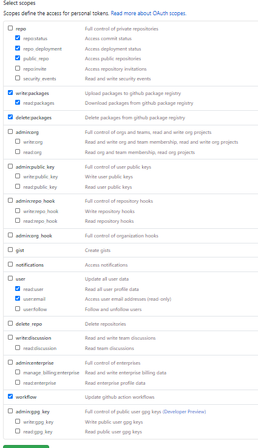
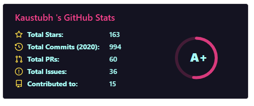

<div align="center">
<h1 align="center">Ultimate Portfolio Maker</h1>
<h3 align="center">Dynamically Self Updating Portfolio</h3>
<h4 align="center"> Developed by: Kaustubh Gupta </h4>
  </div>
<p align="center">


</p>
<p align="center">

</p>

As a developer we create hundreds of repositories and hardly 15-20 of them actually make it to final project we deploy and showcase on social media/LinkedIn. This GitHub action allows you to generate your perfect self updating portfolio with Projects, Hackathons and latest Blogs.

An index file is generated by this action which with the help of GitHub pages gets deployed as soon as it is committed the repository. If you write blogs, then you can integrate [Blog Post Workflow](https://github.com/marketplace/actions/blog-post-workflow) in our workflows to update latest blogs in your portfolio. Let's see how to setup this action!

## Important note

- The repositories need to have `project` topic to add them in project section and `hackathon` topic to add them in hackathon section. If you add both the topics to same repository then it will reflected in both sections!

- You only need to have a GitHub personal access token which can be obtained by going to Settings > Developer Settings > Personal Access Tokens. Generate a new token and give at least give this much permissions:
  <div align="center">  </div>

_Note: If you give personal repositories access then they will be added to the sections but their links will not work_

## Installation

Create a new folder called `.github/workflows/update.yml`, file name is your choice. Paste the following starter code:

```yml
name: Latest portfolio
on:
  schedule:
    # Runs at the end of every day. You can customize according to your need. You can also trigger this action for other events. Check GitHub actions page for that.
    - cron: '0 0 * * *'
  workflow_dispatch:

jobs:
  job_1:
    name: update-index-with-project
    runs-on: ubuntu-latest
    steps:
      - uses: actions/checkout@v2
      - uses: kaustubhgupta/PortfolioFy@v2.0.1 # If any new version is released, kindly specify that or you can directly specify @main to avoid version confusion
        with:
          gh_token: ${{ secrets.TOKEN }} # Create a secret for access token and modify the name as you wish

      - uses: test-room-7/action-update-file@v1
        with:
          file-path: |
            index.html
          commit-msg: index file added
          github-token: ${{ secrets.TOKEN }}
```

_Note: To avoid any error & to stay in latest version of this action, replace `kaustubhgupta/PortfolioFy@v2.0.1` with `kaustubhgupta/PortfolioFy@main`_

## Usage and Options available

This action generates a index.html file which is website ready. Simply enable the GitHub pages to deploy the index file and boom, you have your portfolio which self updates when you add your projects or hackathons projects!

| Option         | Default Value | Description                                                     | Required |
| -------------- | ------------- | --------------------------------------------------------------- | -------- |
| `gh_token`     | NA            | GitHub Personal Access token                                    | Yes      |
| `theme`        | `1`           | Type of webpage you want to render                              | No       |
| `blogs`        | `False`       | Whether you want to include blogs in your Portfolio             | No       |
| `hackathons`   | `False`       | Apart from Personal projects you can include hackathon projects | No       |
| `stats_choice` | `1`           | Which type of GitHub stats you want to display in your profile  | No       |

## Add Blog Updates

There is an action called [Blog Post Workflow](https://github.com/marketplace/actions/blog-post-workflow) which updates latest blogpost on schedule. You can easily integrate this in your workflow via this method: (I highly recommend to use this!)

```yml
name: Latest blog post workflow
on:
  push: # Every time index.html is pushed, this action runs and updates the blogs section!

jobs:
  update-readme-with-blog:
    runs-on: ubuntu-latest
    steps:
      - uses: actions/checkout@v2
      - uses: gautamkrishnar/blog-post-workflow@master
        with:
          feed_list: <Your feedlist>
          max_post_count: 7
          readme_path: index.html
          template: "<h2 class='h2-blog'><a class='a-lightblue' href=$url>$title</a></h2>" # Do not change the template as it will not render good results!
          gh_token: ${{ secrets.TOKEN }}
```

Do enable the blogs parameter in the main workflow too!

```yml
.
.
.
- uses: actions/checkout@v2
        - uses: kaustubhgupta/PortfolioFy@v2.0.1 # If any new version is released, kindly specify that or you can directly specify @main to avoid version confusion
          with:
            gh_token: ${{ secrets.TOKEN }} # Create a secret for access token and modify the name as you wish
            blogs: True
```

## Add Hackathon

Starting version v2.0.1, hackathon is optional to be included in the portfolio. By default, it is False but you can enable it in the workflow as:

```yml
.
.
.
- uses: actions/checkout@v2
        - uses: kaustubhgupta/PortfolioFy@v2.0.1 # If any new version is released, kindly specify that or you can directly specify @main to avoid version confusion
          with:
            gh_token: ${{ secrets.TOKEN }} # Create a secret for access token and modify the name as you wish
            hackathons: True
```

## GitHub Stats Choice

From version v2.0.1, you can choose between two types of stats generation. The basic one looks like this, choice 1: (Made by Anurag Hazra)

<div align="center">  </div>
<br>
Stats Choice 2 gives detailed report of the profile: (Made by Simon Lecoq
)
<div align="center">  </div>
<br>

_Do star the repository! It gives me motivation to develop more projects like this!_

## Multiple Themes

You can select any of the themes depending upon your usage.

### Theme 1

This is a basic level theme.

<p align="center">

</p>

### Theme 2

This is an advanced theme provided by [Start Bootstrap](https://startbootstrap.com/theme/resume). It is fully interactive, good looking and more responsive than first in mobile devices.

<p align="center">

</p>

## Special Mentions

A special thanks to:

- [Anurag Hazra](https://github.com/anuraghazra/github-readme-stats) for creating readme stats Vercel app which is being used for GitHub Stats.
- [Simon Lecoq](https://github.com/lowlighter/metrics) detailed stats generation
- [Gautam Krishna R](https://github.com/marketplace/actions/blog-post-workflow) GitHub action which makes it possible to update blogpost.
- [Rajveer Narag](https://github.com/RajveerN01) for helping out with front-end development and mobile view optimization.
- [Test Room 7](https://github.com/marketplace/actions/update-files-on-github) GitHub action which enables commit of files to repository
- [Start Bootstrap](https://startbootstrap.com/theme/resume) for amazing themes!
- [GitHub actions](https://docs.github.com/en/free-pro-team@latest/actions) docs, it's the best guide!

_Create blogs, videos and tag me! I will definitely have a look and feature them here!_

## Featured Content

- [GitHub Action That Automates Portfolio Generation](https://towardsdatascience.com/github-action-that-automates-portfolio-generation-bc15835862dc) - Medium Blog
- [YouTube Video Guide & Demo](https://youtu.be/uIQhIdErYSk) - By [Mihir Rabade](https://github.com/MRDGH2821)

## License

[](https://choosealicense.com/licenses/mit/)
