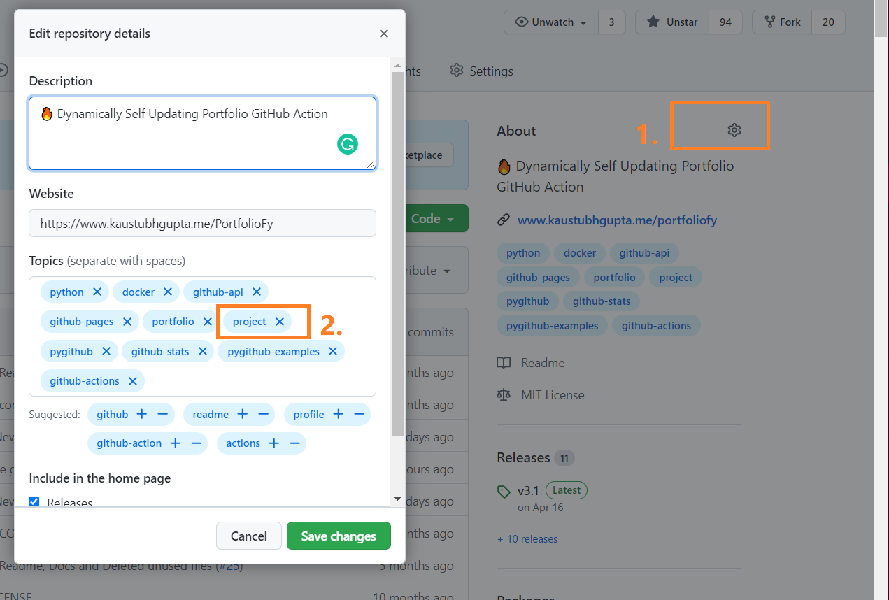
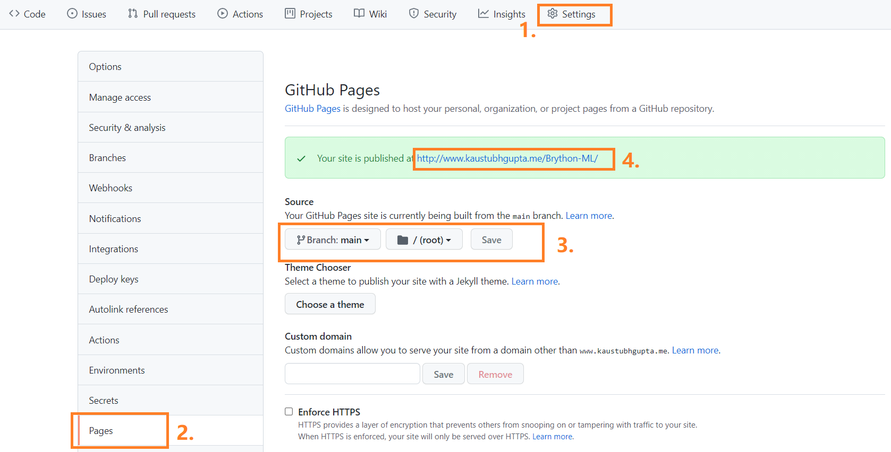

# Preparing the Repositories
- Navigate to your project repository.
- Click on the settings gear on the right and add the `project` topic. For the hackathon project, you should add the `hackathon` topic to the repository.
- Do this for all eligible repositories.



# Obtaining Personal access token
- GitHub token or personal access token is needed for the action to authenticate with GitHub and pull off the data without any usage limits.
- If you already have an access token then you can skip this part.
- For those who haven't generated a GitHub token yet, follow these steps: Go to Settings > Developer Settings > Personal Access Tokens.
- Then enable the following permissions:


- Now, you need to place the token value as a repository secret named `TOKEN` or any name of your choice. To do this, navigate to your repository Settings > Secrets > New repository secret.

# Basic Workflow Setup
- Now, all you need to do is navigate to that repository where you wish to set up the automation process. 
- As this is a portfolio, my suggestion would be to set it up in `<username>.github.io` so that your website can be accessed by using GitHub's co-domain link, and further, you can set up a custom domain for your webpage.
- Still, you can set up this action in any repository of your choice.
- Create a folder called `.github` and inside this, create another folder called `.workflows` (`.` is important for both folders).
- Now create a file with any name of your chance and give it the extension `.yml`. Inside this file, paste the following starter code:

```yml
name: Latest portfolio
on:
  schedule:
    - cron: '0 0 * * *'
    # This makes the action run at the end of every day. Customize this accordingly or you can also trigger this action for GitHub events (Pull, Push). Check the GitHub actions page for that.
  workflow_dispatch:

jobs:
  updating-portfolio:
    name: update-index-with-project
    runs-on: ubuntu-latest
    steps:
      - uses: actions/checkout@v2
      - uses: kaustubhgupta/PortfolioFy@main 
        with:
          gh_token: ${{ secrets.TOKEN }} # Create a secret to store the access token 
```

- As a final step, navigate to the `actions` tab, select `Latest portfolio` from the left menu and click on the `Run workflow` button to trigger the action manually.
- Wait for a minute and boom, you have your index.html file pushed to the repository!

# Enable GitHub Pages
- You have successfully set up the PortfolioFy action. It will update your webpage on the time interval set.
- One last step in this process is to enable the GitHub pages so that you can share your portfolio with the community.
- Simply, follow the instructions shown below:



- Copy the link generated and freely share it with the community :) You can also tag me in your post on Linkedin/Twitter and I would happily share it :)