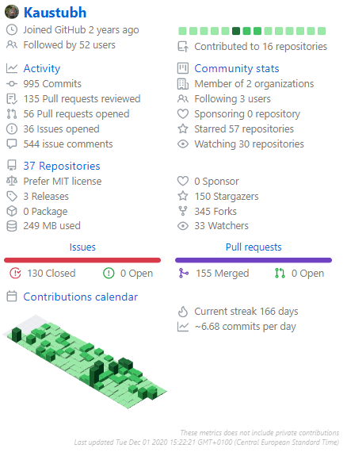

# Git Parameters

These are the parameters that are passed in the GitHub Actions when any user configures this in their repo.

| Option         | Default Value | Description                                                                  | Required | Example |
| -------------- | ------------- | ---------------------------------------------------------------------------- | -------- | ------- |
| `gh_token`     | NA            | GitHub Personal Access token                                                 | Yes      |  NA     |
| `theme`        | `1`           | Level of webpage you want to render: 1 or 2                                   | No       |  1      | 
| `blogs`        | `False`       | Include blogs in your Portfolio              | No       |  True   |
| `hackathons`   | `False`       | Include repositories that were part of hackathon | No       |  True
| `stats_choice` | `1`           | Type of GitHub stats: 1 or 2       | No       |  2
| `social_links` | `False`       | Links for Linkedin, Twitter, Dev.to, Medium, and Stackoverflow.  | No       | 'https://www.linkedin.com/in/kaustubh-gupta/, https://twitter.com/Kaustubh1828, https://medium.com/@kaustubhgupta1828, https://dev.to/kaustubhgupta, https://stackoverflow.com/users/14681298/kaustubh'|
| `resume_link` | `False` | Link for resume pdf uploaded online | False | 'https://drive.google.com/fnskaml' |
| `allow_footer` | `True` | Whether you want to display the credits of the creator the end of the webpage | False | False |


## Theme Level (`theme`)
Currently, there are two levels of the webpage that can be rendered using this action. They are numbered numerically as 1 and 2. You can select any of the themes depending upon your usage.

### Theme 1

This is a basic level theme.


### Theme 2

This is an advanced theme provided by [Start Bootstrap](https://startbootstrap.com/theme/resume). It is fully interactive, good looking and more responsive than first in mobile devices.


## Hackathons Entry (`hackathons`)
Starting version v2.0.1, hackathon is optional to be included in the portfolio. By default, it is False but you can enable it in the workflow as:

```yml
.
.
.
- uses: actions/checkout@v2
        - uses: kaustubhgupta/PortfolioFy@main
          with:
            gh_token: ${{ secrets.TOKEN }} 
            hackathons: True
```
## GitHub Stats Choice
From version v2.0.1, you can choose between two types of stats generation. The basic one looks like this, choice 1: (Made by Anurag Hazra)


<br>
Stats Choice 2 gives detailed report of the profile: (Made by Simon Lecoq
)



<br>

## Add Social Links
You can add your social media links to connect better with your audience. Currently, you can add links of Linkedin, Twitter, Dev.to, Medium, and Stackoverflow. There is no restriction to add all of them. You can skip this parameter, add partial links or all the links depending upon the usage!

```yml
.
.
.
- uses: actions/checkout@v2
        - uses: kaustubhgupta/PortfolioFy@main
          with:
            gh_token: ${{ secrets.TOKEN }} 
            social_links: 'https://www.linkedin.com/in/kaustubh-gupta/, https://twitter.com/Kaustubh1828, https://medium.com/@kaustubhgupta1828, https://dev.to/kaustubhgupta, https://stackoverflow.com/users/14681298/kaustubh'
```