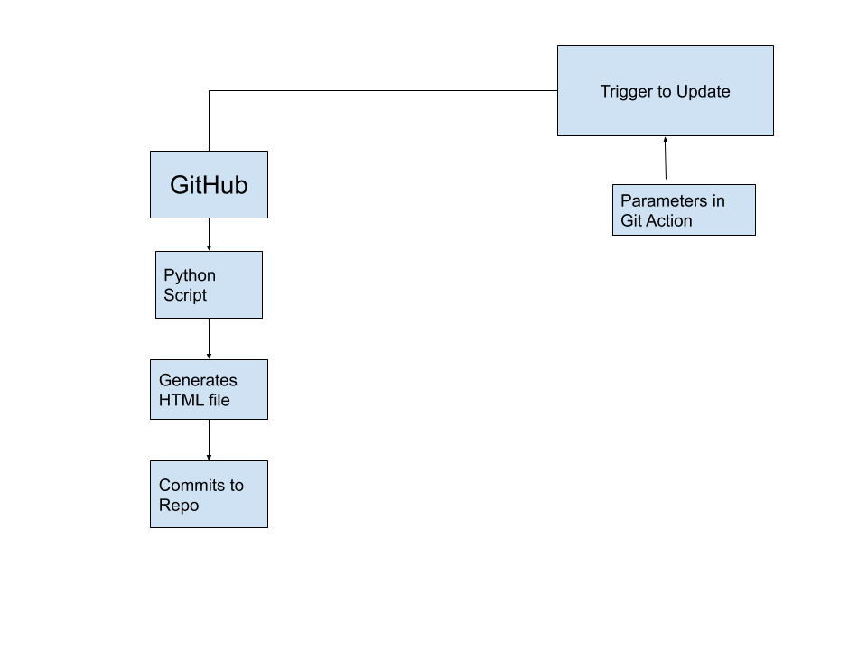

# Main Idea
A Portfolio presents a skill score sheet for any person. It gives an overall preview of what a person is capable of, their interest, and work samples. In any industry, it is important to prepare a portfolio for at least one time. 

A developer is usually occupied with many tasks, and sometimes it becomes difficult to manage the update of the information manually every time. This project tries to solve this problem via automation and scheduled tasks.

# Basic Workflow
(_Note: Here the word "workflow" is not for GitHub actions workflow_)

  

GitHub is the warehouse of the development work done by any developer and that's why it will be the main source of information for us. Fortunately, as GitHub is an open-source platform, it provides the user data access via API(Application Program Interface) that can be parsed using any programming language. I am using Python for this purpose. GitHub provides access to whole data but we require only the important project repositories or [hackathons repositories (if opted)](./pages/Git-Actions-Parameters). To tackle this, one needs to manually assign the label of `project` to the repos and `hackathon` for hackathons.

After the data is required data is cleaned, it is appended to the HTML files that form the base for the portfolio. The HTML files are generated by the Python Scripts that put in all the required data to make the deployable index file.

As this is a web portfolio, hosting is needed which can serve all-day. GitHub again comes to the rescue! It provides free hosting for static pages via GitHub pages. The index file generated needs to be in any repository. Turning on this feature will deploy the website without any recurring costs! 
